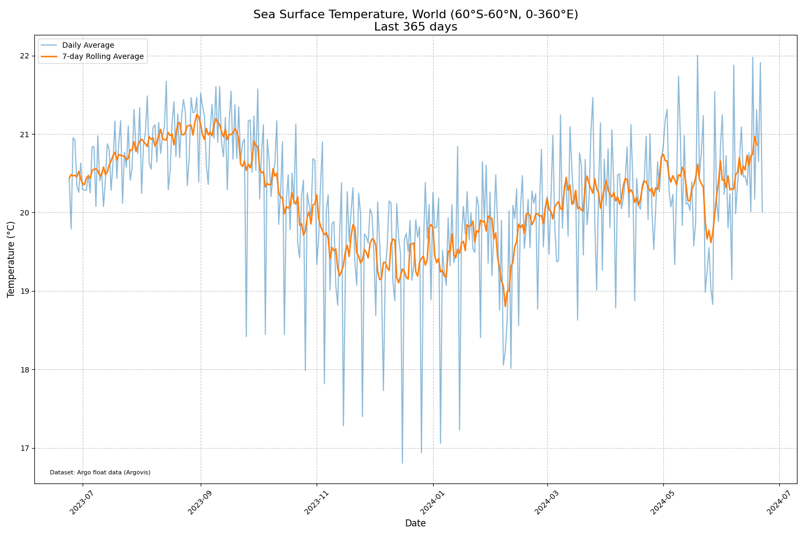

# Overview

recreate a similar graph found here: https://climatereanalyzer.org/clim/sst_daily/

## Quickstart


```
poetry install
```
Note: change the first argument to how many days you want to plot

```
python plot-argo-data.py 60
```

